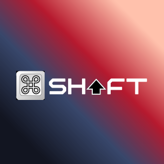

# CmdShift

<div align="center">
  
  
  <h3>AI Without Limits</h3>
  <p>Unlimited AI access at 50-70% lower costs using intelligent multi-model routing</p>
  
  [](LICENSE)
  [](https://nextjs.org/)
  [](https://fastapi.tiangolo.com/)
</div>

## 🚀 What is CmdShift?

CmdShift is a revolutionary AI chat platform that provides unlimited access to multiple Chinese LLM APIs (DeepSeek, GLM-4.5, Qwen) at 50-70% lower costs than Western alternatives. By intelligently routing requests to the optimal model, we eliminate rate limits while maintaining high-quality responses.

## ✨ Features

- **🔄 Multi-Model Intelligence**: Automatic routing between DeepSeek ($0.27/M), GLM-4.5 ($0.11/M), and Qwen ($2.80/M)
- **♾️ No Rate Limits**: Smart load balancing ensures continuous service
- **🧠 Persistent Memory**: 7-day conversation history with Redis
- **💰 Usage Analytics**: Track tokens, costs, and model performance
- **🔐 User Authentication**: Secure login with Supabase
- **💳 Subscription Tiers**: FREE (50/day), STARTER ($9.99), PRO ($19.99)
- **🌓 Dark Mode**: Beautiful UI with shadcn/ui components
- **💬 Conversation Management**: Multiple chats with sidebar navigation

## 🛠️ How It Works

1. **Smart Routing**: Analyzes your query and selects the best model:
   - Coding tasks → DeepSeek
   - General queries → GLM-4.5 (cheapest)
   - Complex reasoning → Qwen

2. **Cost Optimization**: Backend uses models 10-100x cheaper than GPT-4/Claude

3. **Seamless Experience**: Automatic failover and load balancing

## 🚀 Quick Start

```bash
# Clone repository
git clone https://github.com/no9labs/cmdshift-chat.git
cd cmdshift-chat

# Install dependencies
pnpm install

# Set up environment variables
cp apps/api/.env.example apps/api/.env
# Add your API keys for DeepSeek, GLM, and Qwen

# Start services
brew services start postgresql@16 redis

# Run development servers
cd apps/api && uvicorn app.main:app --reload --port 8001  # Terminal 1
cd apps/web && pnpm dev                                   # Terminal 2
Visit http://localhost:3000 to start chatting!
📦 Tech Stack

Frontend: Next.js 14, React, TypeScript, Tailwind CSS, shadcn/ui
Backend: FastAPI, Python 3.9+
Database: PostgreSQL, Redis
Auth: Supabase
Payments: Stripe

🎯 Mission
Democratize AI access by removing artificial limits and building productivity features that amplify human potential.

Built with ❤️ by No9 Labs
